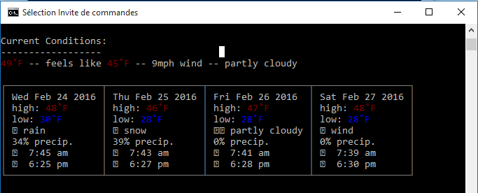

# Cli-Weather


**Table of Contents**  *generated with [DocToc](https://github.com/thlorenz/doctoc)*

- [Introduction](#introduction)
- [Packages Installation](#packages-installation)

## Introduction

Cli-Weather is a client useful to get weather from your terminal. You can easily get the weather online from your current location, or your favorite city ! The forecast is about 4 days :)


## Packages Installation

- Open a console
- Go to the directory `/weather`
- Follow those command lines :

```sh
❯ npm install public-ip
❯ npm install chalk
❯ npm install cli-table
❯ npm install minimist
```

- Test for your current location
```sh
❯ node index.js
```


- Or test from your favorite city
```sh
❯ node index.js -a "Lyon,FR"
```
